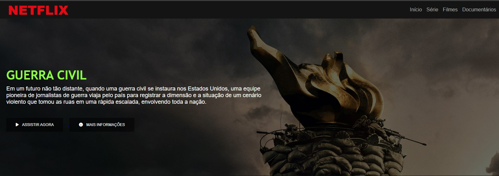
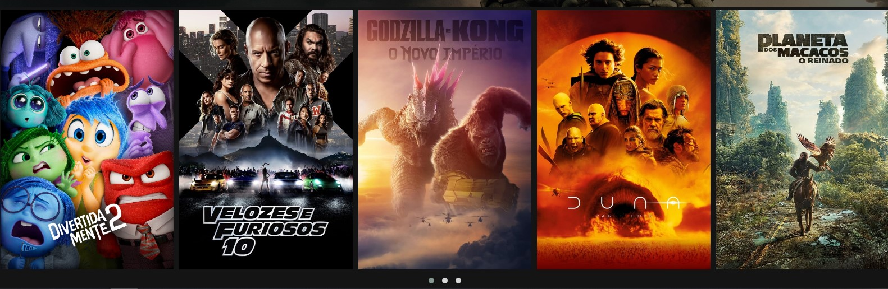

# Projeto Netflix Clone

## Este projeto simula uma interface de catálogo de filmes inspirada na Netflix. O design oferece uma experiência interativa e envolvente para o usuário, permitindo navegação e visualização de informações sobre filmes e séries.

### Funcionalidades
Banner de Destaque: Um banner com o destaque principal do catálogo, incluindo título, descrição e opções para assistir agora ou obter mais informações.
Carrossel de Filmes: Um carrossel com uma seleção de filmes e séries populares, permitindo navegação para visualizar diferentes títulos.

